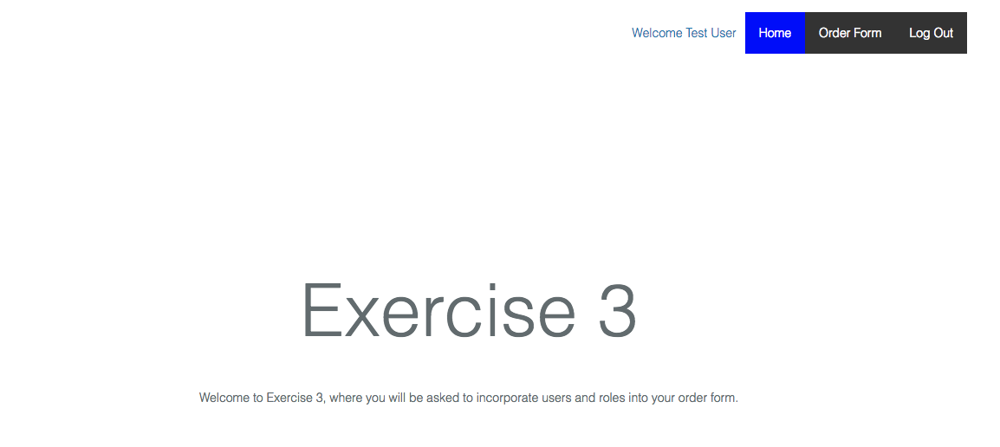
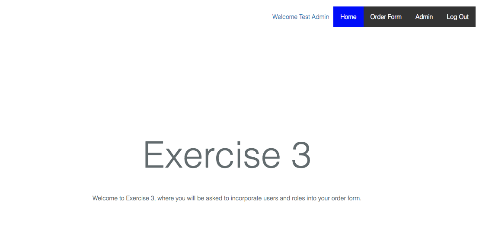
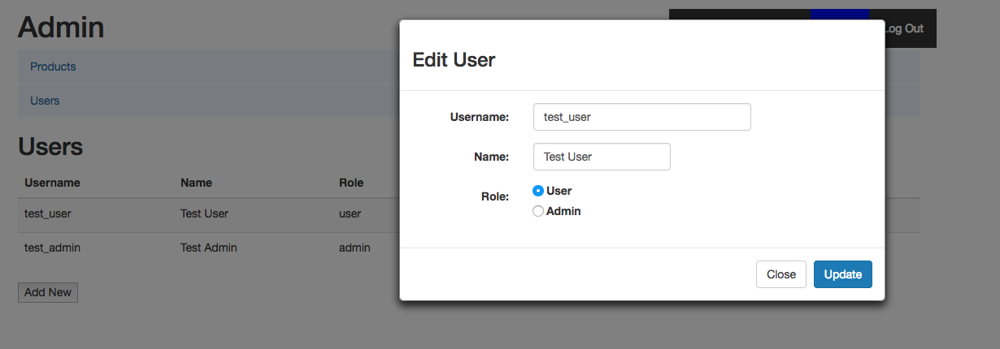
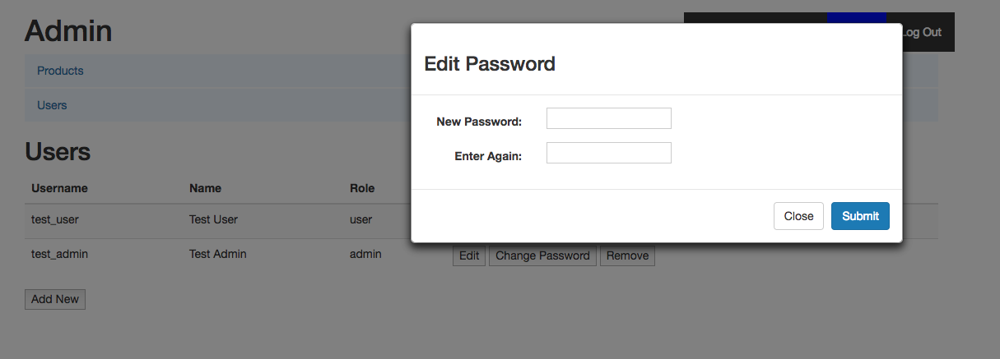

# Exercise 3: Adding Users and Roles

The goal of this exercise is to add users and role functionality to the order form created in the previous exercises.

As always, please run the following commands prior to starting:

1. `composer update`
2. `npm install`
3. `gulp` or `gulp watch`

## Table of Contents

* [Viewing the Code](#viewingthecode)
* [Functionality](#functionality)
    - [Final Product Images](#finalproducts)
- [The Task](#task)
    - [Instructions](#instructions)
    - [Test Cases](#testcases)
- [Important Notes](#important)
    - [AngularJS](#angularjs)
    - [Laravel](#laravel)

<a name="viewingthecode"></a>
## Viewing the Code

1. Run the installation steps shown above
2. Start a local server instance from the Exercise3 directory
`php artisan serve`
3. Open a browser window and go to your localhost, port 8000 (127.0.0.1:8000)

<a name="functionality"></a>
## Functionality

This exercise will include a variety of additions and changes.

* Allow for users to exist
    - Roles are "user" or "admin"
* Add functionality to the administrative page
    - Products
        - Mark an order as fulfilled
        - Cancel an order
    - Display users
        - Edit existing users
        - Change a user's password
        - Remove a user
        - Add a new user
- Add a login page
- Show a menu with changing active tab based on user role
- Show a My Account page
    - Display/edit user information
    - Display user's orders

<a name="finalproducts"></a>
### Final Products

The final products should appear as follows. Please note that exactly copying appearance is not required, however the basic CSS and structure needed has been provided so that it can be used.

#### Login


### Home
**Anonymous User**


**Normal User**


**Admin User**


The only thing needing to be done here is to add the menu.

### Order Form

**Anonymous User**


**Normal User**


**Admin User**


### Admin Page

**Products Tab**


*Note*: Add and Edit modals have not changed from Exercise 2.

**Users Tab**


Two users have been provided by default (will be discussed below).

**Add New User**


The option to add a new user should appear in a modal.

**Edit User**


The option to edit a user should appear in a modal.

**Change Password**


The option to change a user's password should appear in a modal.

### My Account

**Normal User**

*Read Only*


*Edit User*


**Admin User**

*Read Only*


*Edit User*


<a name="task"></a>
## The Task

Your task is to create the functionality described above. You should build upon existing files created/edited in exercises 1 and 2 as well as create new files as necessary.

All AngularJS files should live at `public/js/app` and all template files should be at `resources/views`. The only files that should be changed are

* AngularJS Files
  - `main.js`
  - `app.state.js`
  - `order.controller.js`
- Template Files
  - `admin-angular.blade.php`
  - `home-angular.blade.php`
  - `login.blade.php`
  - `menu.blade.php`
  - `password_modal.blade.php`
  - `product_modal.blade.php`
  - `user_modal.blade.php`
  - `welcome.blade.php`
  - `myaccount.blade.php`

All modal templates can either be used directly or as an example skeleton.

All necessary dependencies, including UI-Router, have already been imported into the HTML, and the module has already been initialized (see resources/views/layouts/application_master.blade.php and resources/views/content.blade.php).

Bootstrap 3 CSS is also included.

The modals and tabs (see admin page) should be created using [UI Bootstrap](https://angular-ui.github.io/bootstrap/), which has already been imported into the HTML. The skeleton for the tabs has been provided.

Please note that the "Available Products" and "Current Orders" sections of the Admin Page have been switch from lists to tables. This is not required, however, the CSS needed to keep them as lists has **not** been provided.

<a name="instructions"></a>
### Instructions

To complete this task, the following must be done<sup>[1](#fn1)</sup>:

* Create a login page.
  - Create a `login` state with these attributes
    - url: `login`
    - templateUrl: `view/login`
- Add the "welcome" page to the SPA
  - Create a `welcome` state with these attributes
    - url: `/`
    - templateUrl: `view/welcome`
* Create a menu and add it to all pages. This **must** be done using a custom directive.
* Update the Admin Page
  - Update the template in `angular-admin.blade.php`
- Create a "My Account" page
    - Create a `myaccount` state with these attributes
        - url: `/myaccount`
        - templateUrl: `view/myaccount`

The final product should match the sample images and all test cases should be true.

<a name="testcases"></a>
### Test Cases

**Order Form**
* All functionality from Exercises 1 and 2 still exist<sup>[2](#fn2)</sup>
* The menu appears with "Order Form" shown as active

**Home**
* The menu appears with "Home" shown as active

**Admin Page**
* The menu appears with "Admin" shown as active
* All functionality from Exercise 2 still exists
* The "Products" tab is open by default
* The "Current Orders" table shows "Yes" or "No" under "Fulfilled?"
* The "Current Orders" table shows the user's name for any order placed by a logged in user
* The "Current Orders" table shows 'Guest' for any order placed by an anonymous user
* When a user presses "Fulfill Order"
  - The fulfillment status for the order changes to "Yes"
  - The "Fulfill Order" and "Cancel Order" buttons for that order disables
- When a user presses "Cancel Order" for an order, the order no longer appears on the table
- When a user submits an order on the Order Form, the order is marked as not fulfilled on the "Current Orders" table
- When a user selects the "Users" tab
  - The "Products" information disappears
  - All existing users appear<sup>[3](#fn3)</sup>
  - The "Remove" button is disabled for the logged in user<sup>[4](#fn4)</sup>
- When a user presses "Add New" a modal appears
- When a user presses close on the "Add New" modal, the "Users" reset to their original state and the modal closes
- When a user presses update on the "Add New" modal, the new user appears under "Users" on the Admin Page and the modal closes
- Submission of a new user uses the API
- If any of the following is true upon submission of a new user, an error message appears, the modal data clears, the modal remains open, and no changes exist in the "Users" list
  - The username field is blank
  - The username is not unique
  - The name field is blank
  - The role field has not been selected
  - The password field is blank
  - The confirm password field is blank
  - The password value does not match the confirm password value
  - The password value is less than 6 characters long
- When a user presses "Edit" for a user, a modal appears
- When a user presses close on the "Edit" modal, the "Users" reset to their original state and the modal closes
- When a user presses update on the "Edit" modal, the user appears under "Users" on the Admin Page with the updated information and the modal closes
- When a user updates their own information and changes their "name", the menu welcome message changes to reflect the name change
- Updating a user uses the API
- When a user's information is updated, those updates are reflected on the My Account page for that user on a subsequent login
- If any of the following is true upon update of a user, a error messages appears, the modal data resets, the modal remains open, and no changes exist in the "Users" list
  - The username field is blank
  - The username is not unique
  - The name field is blank
  - The role field has not been selected
- When a user presses "Change Password" for a user, a modal appears
- When a user presses close on the "Change Password" modal, the "Users" reset to their original state and the modal closes
- When a user presses update on the "Change Password" modal, the modal closes
  - No changes appear on the UI, but logging in as the user requires the new password
- Changing a password for a user uses the API
- If any of the following is true upon update of a password, an error message appears, the modal data resets, and the modal remains open
  - The password field is blank
  - The confirm password field is blank
  - The password value does not match the confirm password value
  - The password value is less than 6 characters long
- When a user presses "Remove" for a user, the user no longer appears under "Users"

**Login**

* The menu appears with "Login" shown as active
* When a user enters their username and password correctly and presses "Login", they are redirected to the "Home" page
  - The username appears on the menu
  - The user remains logged in unless the SPA restarts (i.e., the page is reloaded)
- If any of the following is true upon login, error messages appear, the user remains on the login page, and no username appears on the menu
  - The username field is blank
  - The password field is blank
  - The username cannot be found
  - The password is invalid for the username

**Menu**

* The menu is created using a custom directive
* The menu appears on every page
* The menu shows a "Home" button that is active at `/`
* The menu shows an "Order Form" button that is active at `/angular`
* If a user is logged in, the menu shows a welcome message including their name
    - This message is a link to the "My Account" page for the user
* If a user is logged in and has a role of "admin", the menu shows an "Admin" button that is active at `/admin/angular`
* If a user is logged in, the menu shows a "Logout" button
* If a user is not logged in, the menu shows a "Login" button that is active at `/login`

**My Account**

In this section, user refers to the logged in user.

* The menu appears with *no* active tab
* The user's username appears in the page title
* The user's username and name appear statically under "Account information" when the page loads
* When the user presses "Edit", a form appears allowing the user to edit their
    - Username
    - Name
    - Password
- When the user presses "Edit", the password field is disabled and the change password checkbox is unchecked by default
- When the user checks the change password checkbox, the password field enables
- When the user checks the change password checkbox, a confirm password box appears
- When the user unchecks the change password checkbox, the password field disables
- When the user unchecks the change password checkbox, the confirm password field disappears
- When the user unchecks the change password checkbox, the password field resets to its original value
- When the user presses "Cancel", the fields reset to their original values (i.e., if "Edit" is pressed again, the changes do not persist)
- When the user presses "Cancel", the change password field becomes unchecked and the password field disables
- When the user presses "Cancel", the form disappears and the original, unchanged account information displays
- When the user presses "Submit", the form disappears and the account information displays with any changes made
- When a user presses "Submit" after changing their "name", the menu welcome message changes to reflect the name change
- When a user presses "Submit" after changing their "username", the page title changes to reflect the name change
- Updating a user's information uses the API
- When a user updates their information, on a subsequent login by an admin user, the changes are reflected on the admin page
- If any of the following is true upon submission of a user update, error messages appear, no menu or header changes occur, and the form remains visible
    - The username field is blank
    - The username is not unique
    - The name field is blank
    - The password field is blank if and only if change password is unchecked
    - The confirm password field is blank if and only if change password is unchecked
    - The password field does not match the confirm password field if and only if change password is unchecked
- The user's orders appear in a table (none by default)
- When a the user submits an order from the Order Form, the new order(s) appear under "My Orders", marked as unfulfilled
- Any fulfilled order has its "Cancel Order" button disabled
- When the user presses "Cancel Order", the order disappears from the list
- When the user presses "Cancel Order", the order no longer appears on the "Current Orders" list on the admin page

**Logout**

- When the user presses Log Out the menu welcome message is removed
- When the user presses Log Out the Admin Page button disappears (if applicable)
- When the user presses Log Out they are directed to the Login page with that menu button active
- After the user presses Log Out, if they click on any of the menu links they are directed to the page, but are considered anonymous

<a name="important"></a>
## Important Notes

<a name="angularjs"></a>
### AngularJS
* All AngularJS code should use the [John Papa style guide](https://github.com/johnpapa/angular-styleguide/blob/master/a1/README.md)
* If creating new files:
    - Put them in `public/js/app`
    - In order for files to compile automatically with `gulp` or `gulp watch`
      - Controllers should use ".controller.js"
      - Services and/or factories (if used) should use ".service.js"
      - Directives should use ".directive.js"
    - Any other files will needs to be added to `gulpfile.js`. For example, if creating a `app.config.js` file, update to:
    ```javascript
    mix.scripts([
        '../../../public/js/app/main.js',
        '../../../public/js/app/app.state.js',
        '../../../public/js/app/*.controller.js',
        '../../../public/js/app/*.directive.js',
        '../../../public/js/app/*.service.js',
        '../../../public/js/app/app.config.js'
    ], 'public/dist/js/main.js');
    ```
    Run `gulp` or restart `gulp watch` after updating
* Any time a change is made to one of the AngularJS files, you will need to run `gulp` to view the change. This can be prevented by running `gulp watch` prior to starting.

<a name="laravel"></a>
### Laravel

Since this exercise does **not** require Laravel knowledge, the following should be kept in mind:

* Templates, while Blade PHP files, should be normal HTML (see `home-jquery.blade.php`)
* If creating new templates, they should be named using ".blade.php" and should live in `resources/views`
* In order to not conflict with Laravel, start and end symbols have been changed. Use `<%` and `%>` instead of `{{` and `}}` (see [$interpolateProvider documentation](https://docs.angularjs.org/api/ng/provider/$interpolateProvider))

  For example, use `<% vm.variableName %>` instead of `{{ vm.variableName }}`

---
## Footnotes

<a name="fn1"></a>
[1] Please keep in mind that these are bare-bones instructions and do not include all steps. They do assume that Exercises 1 and 2 are already complete.

<a name="fn2"></a>
[2] Original products should match Exercise 1

<a name="fn3"></a>
[3] By default, two users will exist with the following information. Only Username, Name, and Role should be visible.

| ID | Username   | Name       | Password  | Role  | Token      |
| -- | ---------- | ---------- | --------- | ----- | ---------- |
| 1  | test_user  | Test User  | testuser  | user  | 1k4hd2hf9d |
| 2  | test_admin | Test Admin | testadmin | admin | 9d62hdo39a |

<a name="fn4"></a>
[4] This is to prevent a user from removing themselves while logged in
