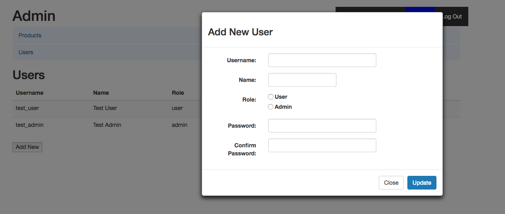

# Exercise 3: Adding Users and Roles

The goal of this exercise is to add users and role functionality to the order form created in the previous exercises.

As always, please run the following commands prior to starting:

1. `composer update`
2. `npm install`
3. `gulp` or `gulp watch`

## Viewing the Code

1. Run the installation steps shown above
2. Start a local server instance from the Exercise3 directory
`php artisan serve`
3. Open a browser window and go to your localhost, port 8000 (127.0.0.1:8000)

## Functionality

This exercise will include a variety of additions and changes.

* Allow for users to exist
    - Roles are "user" or "admin"
* Add functionality to the administrative page
    - Products
        - Mark an order as fulfilled
        - Cancel an order
    - Display users
        - Edit existing users
        - Change a user's password
        - Remove a user
        - Add a new user
- Add a login page
- Show a menu with changing active tab based on user role

### Final Products

The final products should appear as follows. Please note that exactly copying appearance is not required, however the basic CSS and structure needed has been provided so that it can be used.

#### Login

### Home
**Anonymous User**

**Normal User**

**Admin User**

The only thing needing to be done here is to add the menu.

### Order Form

**Anonymous User**

**Normal User**

**Admin User**

### Admin Page

**Products Tab**

*Note*: Add and Edit modals have not changed from Exercise 2.

**Users Tab**

Two users have been provided by default (will be discussed below).

**Add New User**

The option to add a new user should appear in a modal.

**Edit User**

The option to edit a user should appear in a modal.

**Change Password**

The option to change a user's password should appear in a modal.

## The Task

Your task is to create the functionality described above. You should build upon existing files created/edited in exercises 1 and 2 as well as create new files as necessary.

All AngularJS files should live at `public/js/app` and all template files should be at `resources/views`. The only files that should be changed are

* AngularJS Files
  - `main.js`
  - `app.state.js`
  - `order.controller.js`
- Template Files
  - `admin-angular.blade.php`
  - `home-angular.blade.php`
  - `login.blade.php`
  - `menu.blade.php`
  - `password_modal.blade.php`
  - `product_modal.blade.php`
  - `user_modal.blade.php`
  - `welcome.blade.php`

All modal templates can either be used directly or as an example skeleton.

All necessary dependencies, including UI-Router, have already been imported into the HTML, and the module has already been initialized (see resources/views/layouts/application_master.blade.php and resources/views/content.blade.php).

Bootstrap 3 CSS is also included.

The modals and tabs (see admin page) should be created using [UI Bootstrap](https://angular-ui.github.io/bootstrap/), which has already been imported into the HTML. The skeleton for the tabs has been provided.

Please note that the "Available Products" and "Current Orders" sections of the Admin Page have been switch from lists to tables. This is not required, however, the CSS needed to keep them as lists has **not** been provided.

### Instructions

To complete this task, the following must be done1:

* Create a login page.
  - Create a `login` state with these attributes
    - url: `login`
    - templateUrl: `view/login`
- Add the "welcome" page to the SPA
  - Create a `welcome` state with these attributes
    - url: `/`
    - templateUrl: `view/welcome`
* Create a menu and add it to all pages. This **must** be done using a custom directive.
* Update the Admin Page
  - Update the template in `angular-admin.blade.php`

The final product should match the sample images and all test cases should be true.

#### Test Cases

**Order Form**
* All functionality from Exercises 1 and 2 still exist2
* The menu appears with "Order Form" shown as active

**Home**
* The menu appears with "Home" shown as active

**Admin Page**
I AM HERE

[1] Please keep in mind that these are bare-bones instructions and do not include all steps. They do assume that Exercises 1 and 2 are already complete.

[2] Original products should match Exercise 1
